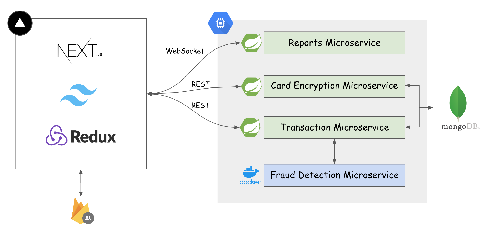

# TikTok Hackathon Challenge 2023 Project Readme - FraudNow

Welcome to our Tiktok Hackathon Challenge 2023 project! Our chosen problem statement is on Reshaping Payments. 

This README provides an overview of our project (**FraudNow**), its components, and how to get started.

## Project Overview

Our project is a comprehensive solution for fraud detection in financial transactions. We have developed a web application with a user-friendly front-end and a robust back-end that incorporates machine learning for fraud detection. Here are the key components:

- **Frontend**:
  - Built with **Next.js** for a fast and responsive user interface.
  - State management is handled with **Redux** for efficient data flow.
  - We've used **Tailwind CSS** for a sleek and modern design.

- **Backend**:
  - Developed using **Spring Boot**, a powerful and scalable Java framework.
  - Data storage is managed using **MongoDB**, a NoSQL database, for flexibility and scalability.

- **Authentication**:
  - User authentication is handled by **Firebase Auth**, providing secure and easy-to-use authentication methods.

- **Machine Learning Model**:
  - Our project incorporates an AI model for **fraud detection**, enhancing the security of financial transactions.
  - The AI model is containerized using **Docker** for easy deployment and scalability.

### Architecture Diagram

## Repositories
- frontend: https://github.com/Gene9898/tiktok-hackathon-frontend
- backend: https://github.com/luayida99/tiktok-hackathon-backend
- ml-model: https://github.com/benedictchuajj/tiktok-fraud-detection

## Getting Started

To get started with our project, follow these steps:

### Prerequisites

Make sure you have the following prerequisites installed on your system:

- Node.js and npm (for the front-end)
- Java and Spring Boot (for the back-end)
- MongoDB (for data storage)
- Firebase account (for authentication)
- Python and necessary libraries (for machine learning)
- Docker (for containerization)

### Setup

Follow the instructions in each repository to setup the project.

### Accessing the Application

Once everything is set up and running, you can access the application in your web browser. By default, it should be available at `http://localhost:3000`.

## Usage

Our application allows users to:

- Sign up and log in using Firebase Auth.
- Perform financial transactions securely.
- Benefit from AI-powered fraud detection.
- Visualize their transaction history.

Feel free to explore the various features and functionalities of our application to understand how we've implemented fraud detection and ensured secure financial transactions.

## Contributors

- [Eugene Lum](https://github.com/Gene9898) - Frontend development
- [Jeremy Lee](https://github.com/Jermy-Lee) - Frontend development
- [Jonathan Lee](https://github.com/jonlee1923) - Backend development
- [Lua Yi Da](https://github.com/luayida99) - Backend development
- [Benedict Chua](https://github.com/benedictchuajj) - Machine Learning and AI

## Acknowledgments

We would like to express our gratitude to the organizers of this hackathon for providing us with the opportunity to work on this project. We hope our solution demonstrates the potential for enhanced security in financial transactions through the integration of machine learning and modern web technologies.

Happy hacking!